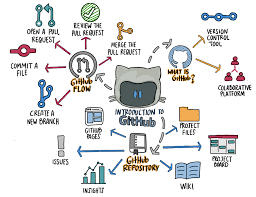
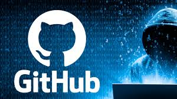
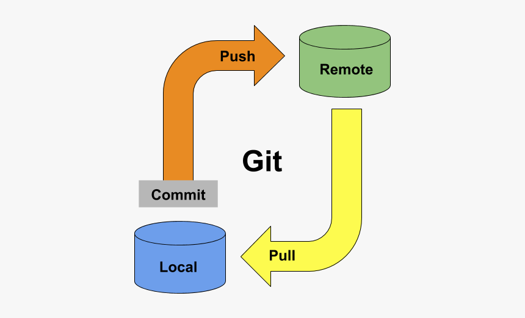

# ProjectGIT
# 📘 INTRODUCCIÓN AL CURSO GIT Y GITHUB

Bienvenido a mi resumen personal del curso de **Git y GitHub**.
---

<p align="center">
  
</p>

# ¿Qué es un control de versiones?

El control de versiones es una herramienta que guarda el historial de todos los cambios realizados en los archivos de un proyecto.

---

<p align="center">
  
</p>

---

Esto permite conocer qué modificaciones se hicieron, quién las realizó y en qué momento, facilitando el seguimiento y la gestión del proyecto a lo largo del tiempo.

# ¿Por qué es tan importante un control de versiones?

🔹 **Optimización**: Solo se guarda lo esencial, lo que mejora el rendimiento del proyecto.
🔹 **Seguridad**: Cada acción queda registrada, garantizando que nada se pierda.
🔹 **Flexibilidad**: No es necesario seguir un camino único en el desarrollo; puedes experimentar sin perder el control.

---

<p align="center">
  
</p>

# Historia de GIT Y GITHUB

---

1990s: Los primeros sistemas de control de versiones fueron creados.
2005: **Linus Torvalds** creó Git para gestionar el código del kernel de Linux.
2008: Se fundó **GitHub**, una plataforma para alojar proyectos Git en la web.
2018: **Microsoft** adquirió **GitHub**.
2024: **Git** y **GitHub** siguen siendo herramientas esenciales para el desarrollo de software, ampliamente utilizadas en la industria.

---

<p align="center">
  
</p>

# ¿Qué es GIT y GITHUB?

**Git** es un sistema de control de versiones distribuido que ayuda a gestionar y hacer seguimiento de los cambios en los proyectos de software.

**GitHub** es una plataforma basada en la web que aloja proyectos Git, facilitando la colaboración y el control de versiones entre desarrolladores.

---

<p align="center">
  
</p>

# ¿Qué es un repositorio?

Un **repositorio** es un lugar donde se guarda el código fuente y su historial de cambios. Puede estar en tu máquina local o en una plataforma en línea como **GitHub**, permitiendo colaborar y gestionar proyectos de software.

---

<p align="center">
  
</p>

# 🚀 INICIEMOS UN NUEVO PROYECTO GIT

📌 A continuación, te muestro los comandos básicos para comenzar un proyecto Git desde cero.

---

<p align="center">
  
</p>

---

### ✅ 1. Crear la carpeta del proyecto


    mkdir miproyecto
    cd miproyecto
✅ 1. Inicializar Git

    git init
✅ 2. Crear un archivo (ejemplo)

    echo "# Mi proyecto" > README.md
✅ 3. Agregar archivo al staging

    git add README.md
✅ 4. Hacer el primer commit

    git commit -m "Primer commit"
¿Quieres incluir el repositorio en GitHub también? Puedes usar git remote add origin <URL> y luego git push -u origin main.

❓ ¿Este proyecto tiene commits?
Un proyecto tiene commits solo si ya ejecutaste:


    git commit -m "mensaje"
🔹 Si solo hiciste git init y no has hecho ningún commit aún → No tiene commits.
🔹 Si ya hiciste un commit con mensaje → Sí tiene al menos un commit.

✅ Para verificar si tu proyecto tiene commits:


    git log

# 💻 INSTALACIÓN DE GIT EN WINDOWS

A continuación, te muestro paso a paso cómo instalar Git en tu sistema Windows.

---

🔹Descargar Git:

🔹Ve a la página oficial de Git: https://git-scm.com/download/win.

🔹El archivo de instalación se descargará automáticamente para Windows.

🔹Ejecutar el instalador:

🔹Abre el archivo descargado (.exe) para iniciar el proceso de instalación.

🔹En las opciones de instalación, puedes dejar las configuraciones predeterminadas, pero ten en cuenta lo siguiente:

🔹Selecciona "Use Git from the Windows Command Prompt" para poder usar Git desde la terminal de Windows.

🔹Git Bash será instalado por defecto, lo que te permitirá usar un terminal similar a Unix.

🔹Configurar Git (opcional pero recomendado):

🔹Después de la instalación, abre Git Bash y configura tu nombre y correo electrónico:


    git config --global user.name "Tu Nombre"
    git config --global user.email "tuemail@example.com"
Verificar la instalación:

Abre Git Bash o la terminal de Windows y ejecuta:


    git --version
Esto debería mostrar la versión de Git instalada.

¡Listo! Ahora tienes Git instalado y configurado en tu sistema Windows 10.

---

<p align="center">
  <strong>Instalación de Git y GitHub en Windows</strong><br>
  
</p>

---

✨ States y commits de Git y GitHub

¿Sabías que en Git todo pasa por 3 estados antes de subirlo a GitHub?
Es como cocinar:
Working Directory: estás cocinando, todo es un desastre pero vas viendo
🧠 States y commits de Git y GitHub
<p align="center">  </p>
🤔 ¿Y eso de los estados qué onda?
Antes de subir algo a GitHub, Git lo pasa por tres estados básicos, que se sienten más o menos así:

🔧 Working Directory → Estás editando archivos como loco, probando y rompiendo cosas.

📦 Staging Area → Elegiste qué cosas sí quieres guardar. Es como tenerlo listo pero no entregado.

📸 Repository (commit) → Ya está listo y guardado oficialmente en la historia del proyecto. ¡Es como una foto que ya subiste a tu álbum de GitHub


📝 Un commit, ¿qué es?
<p align="center">  </p>
💡 ¿Qué es un commit?
Un commit es como dejar una nota con la foto del momento de tu proyecto.
Dice: “esto fue lo que hice” y queda guardado para siempre.
Cada vez que haces un commit, estás construyendo la historia de tu código, paso a paso.
Y sí, puedes volver atrás si algo explota. 😅


💡 ¿Y cómo se hace un commit?
Hacer un commit es como decir:

"Listo, terminé esta parte. ¡Guárdalo así!"

Es súper fácil, solo tienes que seguir estos pasos:

🧩 Pasos para hacer un commit

# 1. Ver qué archivos cambiaron
    git status

# 2. Añadir archivos al área de preparación (staging)
    git add archivo.txt

# O si quieres agregar todos los archivos modificados:
    git add .

# 3. Hacer el commit con un mensaje
    git commit -m "Explicación corta de lo que hiciste"
🚀 Subirlo al repositorio remoto (GitHub)

    git push origin main

´´´
# 💻 ¿Que es HEAD y para que sirve?

<p align="center">  </p>

🔹HEAD es como el apuntador de tu proyecto. Te muestra en qué parte de la historia de tu código te encuentras.
Cuando usas HEAD, estás viendo la última versión registrada en tu repositorio. Es esencial para saber en qué punto estás y para cambiar entre ramas o versiones de tu proyecto.

¿Qué hace HEAD?
Se mueve automáticamente cuando haces un commit.

🔹Te ayuda a navegar entre distintas versiones del proyecto.

🔹Es el punto de referencia de tu trabajo actual.

🔹Comandos relacionados con HEAD
Ver HEAD actual:

    git log -1
🔹Mover HEAD a un commit específico (deshacer cambios, revisar versiones anteriores):

    git checkout <commit-id>
🔹Volver a la rama principal (main) después de moverse con HEAD:

    git checkout main
🔹Mover HEAD a una rama específica:

    git checkout <nombre-de-la-rama>


# Qué son ramas, merge y cuáles son sus conflictos

<p align="center">
  
</p>

### 🔹 ¿Qué son las ramas en Git?

Las ramas en Git son como diferentes versiones del proyecto que permiten trabajar en distintas funcionalidades sin afectar el código principal.

### 🔹 ¿Qué es un Merge?

Merge es el proceso de combinar dos ramas diferentes. Se hace para integrar cambios de una rama a otra.

### 🔹 Conflictos de merge

Cuando dos personas modifican la misma parte de un archivo, Git no sabe cuál cambio mantener, y eso genera un conflicto. Se debe resolver manualmente.

### 🚀 Comandos para trabajar con ramas y merge

1. **Crear una rama:**
   ```bash
   git branch <nombre-de-la-rama>

2. **Cambiarse a una rama:**
    ```bash
    git checkout <nombre-de-la-rama>
3. **Fusionar una rama con la rama principal (main):**
    ```bash
    git merge <nombre-de-la-rama>
4. **Resolver conflictos de merge:**
Cuando encuentras un conflicto, Git te lo indicará y debes resolverlo manualmente editando el archivo.


## ✨ GIT Y GITHUB SON LO MISMO?
<p align="center">
  
</p>

> **Contexto:**
> Aunque a menudo se usan juntos, **Git** y **GitHub** representan conceptos diferentes en el mundo del control de versiones y la colaboración en proyectos de software.

---

### 🗂️ ¿Qué es Git?

Git es un **sistema de control de versiones distribuido**, que permite:

* Registrar el historial completo de cambios en tu proyecto.
* Crear ramas y fusionarlas para desarrollar funcionalidades aisladas.
* Deshacer o revisar versiones anteriores cuando sea necesario.

**Comandos básicos de Git:**


# Inicializar un repositorio local
    git init

# Ver estado de archivos
    git status

# Añadir cambios al área de preparación
    git add <archivo>
# o todos los archivos
    git add .

# Guardar cambios en el historial
    git commit -m "Mensaje descriptivo"

# Crear y cambiar a una nueva rama
    git checkout -b <nombre-de-la-rama>

# Cambiar de rama
    git checkout <rama>

# Fusionar rama a la actual
    git merge <rama>
`

### 🌐 ¿Qué es GitHub?
<p align="center">
  
</p>

GitHub es una **plataforma en la nube** que hospeda repositorios Git, ofreciendo:

* Interfaz web para revisar, comentar y gestionar código.
* Mecanismos de colaboración: *pull requests*, *issues*, *reviews*.
* Integraciones con CI/CD, proyectos y wikis.

**Comandos para interactuar con GitHub:**

# Conectar remoto (solo una vez)
    git remote add origin <URL-del-repositorio>

# Subir rama actual al remoto
    git push origin <rama>

# Obtener cambios del remoto
    git pull origin <rama>


## 📦 Repositorios Remotos
<p align="center">
  
</p>

Un **repositorio remoto** es la copia de tu proyecto alojada en un servidor (GitHub, GitLab, Bitbucket...). Sirve para:

* Compartir el código con el equipo.
* Mantener un respaldo seguro y accesible.
* Colaborar mediante *push* y *pull*.

**Principales comandos remotos:**


# Listar remotos configurados
    git remote -v

# Agregar un nuevo remoto
    git remote add <alias> <URL>

# Renombrar un remoto
    git remote rename <alias> <nuevo-alias>

# Eliminar un remoto
    git remote remove <alias>
## 🧭 Navegando en GitHub
<p align="center">
  
</p>

En GitHub, puedes explorar tu proyecto y el de otros mediante:

* **Repositories:** Lista de proyectos disponibles.
* **Branches:** Seleccionar distintas ramas desde el menú desplegable.
* **Pull Requests:** Revisar y aceptar aportes de otros colaboradores.
* **Issues:** Reportar errores, discutir mejoras y asignar tareas.

**Flujo rápido en la web:**

1. Ir a **Code** > seleccionar rama.
2. Comprobar **Commits**, **Branches** o **Tags**.
3. Crear un **Pull request**.
4. Revisar cambios y **Merge**.

---
## ✨ GIT PUSH Y GIT PULL?
<p align="center">
  
</p>


> **Contexto:**
> Mantener tu repositorio local sincronizado con el remoto es crítico para colaborar eficientemente en equipos. Los comandos **`git push`** y **`git pull`** son la columna vertebral de esta sincronización. A continuación tienes un compendio detallado, con variantes, opciones avanzadas y flujos de Pull Request completos.

## 📤 git push

El comando **`git push`** envía uno o más refs (ramas, etiquetas) desde tu repositorio local al remoto.

### 🔑 Conceptos clave

* **Upstream vs Origin**: Puedes definir un remoto de seguimiento distinto al predeterminado (`origin`) usando `git remote add upstream <URL>` y luego hacer `git push upstream <rama>`.
* **Tracking Branches**: Con `git push -u origin <rama>`, estableces la rama local para rastrear la remota, simplificando futuros `git push`.

### 🛠️ Comandos y variantes


# Enviar la rama actual al remoto configurado (origin)
    git push origin HEAD

# Establecer upstream y enviar (solo la primera vez)
    git push -u origin <nombre-de-la-rama>

# Enviar todas las ramas al remoto
    git push --all origin

# Enviar etiquetas
    git push --tags origin

# Eliminar una rama remota
    git push origin --delete <nombre-de-la-rama>

# Forzar el push (con precaución)
    git push --force-with-lease origin <rama>

# Espejar todo el repositorio (refs, tags, ramas)
    git push --mirror <URL-remoto>


### ⚠️ Buenas prácticas

* **Evita** usar `--force` sin `--force-with-lease`, para no sobrescribir cambios ajenos por accidente.
* **Revisa** siempre `git status` y `git log --oneline` antes de empujar.

---

## 📥 git pull

El **`git pull`** combina dos operaciones: `git fetch` (descarga objetos y refs) y `git merge` o `git rebase` (integra los cambios).

### 🔍 ¿Merge o Rebase?

* **Merge** (por defecto): Crea un commit de fusión, preservando el historial de ramas. Útil para mantener el contexto de trabajo.
* **Rebase**: "Reescribe" tu serie de commits sobre la punta de la rama remota, produciendo un historial lineal. Ideal para limpiar antes de integrar.

### 🛠️ Comandos y variantes


# Pull estándar (fetch + merge)

    git pull origin <rama>

# Pull con rebase en lugar de merge
    git pull --rebase origin <rama>

# Solo fetch (sin merge/rebase)
    git fetch origin <rama>

# Fetch de todas las ramas y tags
    git fetch --all --tags

# Fetch y limpiar ramas remotas eliminadas
    git fetch -p


### 🔄 Sincronizar fork con upstream


# Configurar upstream si no existe
git remote add upstream <URL-del-repositorio-original>

# Traer cambios sin fusionar
git fetch upstream

# Rebase de tu main sobre upstream/main
   
    git checkout main
    git rebase upstream/main

# Push de tus cambios a tu fork
    git push origin main
`

---

## 🔀 Pull Requests (PR)
<p align="center">
  
</p>


Un **Pull Request** es la forma de proponer, discutir y revisar cambios en GitHub antes de fusionarlos a la rama principal.

### ✅ Flujo manual en GitHub

1. **Crear una rama de trabajo**:

       git checkout -b feature/nombre-funcionalidad
   ```
2. **Trabajar y commitear**:

   
       git add .
       git commit -m "Agrega descripción de la funcionalidad"
   ```
3. **Enviar la rama al remoto**:

     
       git push -u origin feature/nombre-funcionalidad
   
4. **Abrir PR** en GitHub:

   * Pulsa **New pull request**, elige tu rama y añade título y descripción.
   * Asigna revisores y etiquetas (labels).

### 🤖 Flujos con GitHub CLI


# Iniciar sesión
    gh auth login

# Crear PR desde la rama actual a main
    gh pr create \
  --title "[Feature] Nombre de la funcionalidad" \
  --body "Descripción detallada de los cambios" \
  --base main --head feature/nombre-funcionalidad

# Listar PR abiertas
    gh pr list

# Ver detalles de una PR específica
    gh pr view <número> --web

# Revisar localmente una PR
    gh pr checkout <número>

# Aprobar una PR
    gh pr review <número> --approve

# Fusionar una PR por CLI
    gh pr merge <número> --merge
``

---

## 💡 Hacer una PR desde línea de comandos sin CLI

Si no deseas instalar GitHub CLI, puedes abrir la URL directa tras `git push`:


# Tras git push -u origin feature/nombre-funcionalidad
    git push
# GitHub imprime la URL para crear PR, p.e.:
# https://github.com/usuario/repositorio/pull/new/feature/nombre-funcionalidad
`

---

### 📜 Resumen de comandos

| Acción                      | Comando                                          |
| --------------------------- | ------------------------------------------------ |
| Iniciar repositorio         | `git init`                                       |
| Ver estado                  | `git status`                                     |
| Agregar cambios             | `git add <archivo>` / `git add .`                |
| Guardar cambios             | `git commit -m "mensaje"`                        |
| Crear/Cambiar a rama        | `git checkout -b <rama>` / `git checkout <rama>` |
| Push rama al remoto         | `git push -u origin <rama>`                      |
| Pull rama del remoto        | `git pull origin <rama>`                         |
| Fetch sin merge             | `git fetch origin <rama>`                        |
| Merge rama a la actual      | `git merge <rama>`                               |
| Rebase rama remota en local | `git pull --rebase origin <rama>`                |
| Eliminar rama remota        | `git push origin --delete <rama>`                |
| Push todas las ramas        | `git push --all origin`                          |
| Push etiquetas              | `git push --tags origin`                         |
| Pull request manual         | `gh pr create` (CLI) o desde web                 |

---

> Mantén siempre tu repositorio local y remoto sincronizados, respeta los flujos de trabajo de tu equipo y usa variantes avanzadas con precaución. ¡Feliz codificación!

Pensado durante un par de segundos


``markdown

## ✨ GITFLOW?
<p align="center">
  
</p>


> **Contexto:**
> Gitflow, diseñado por Vincent Driessen en 2010, es un modelo de branching que organiza el desarrollo en ramas bien definidas para features, releases y hotfixes.


---

### 🗂️ Principales ramas en Gitflow
- `main` (o `master`): Código de producción estable.
- `develop`: Integración continua de nuevas funcionalidades.
- `feature/<nombre>`: Cada nueva funcionalidad, partiendo de `develop`.
- `release/<versión>`: Preparación de la siguiente versión, partiendo de `develop`.
- `hotfix/<versión>`: Corrección urgente, partiendo de `main`, fusionada luego en `develop` y `main`.

---

### 🛠️ Comandos básicos (git-flow AVH)

# Inicializar Gitflow en tu proyecto
    git flow init

# Trabajar con feature
    git flow feature start <nombre>
# terminar feature
    git flow feature finish <nombre>

# Trabajar con release
    git flow release start <version>
    git flow release finish <version>

# Trabajar con hotfix
    git flow hotfix start <version>
    git flow hotfix finish <version>
`


## 💠 GITHUB FLOW

> **Contexto:**
> GitHub Flow es ligero y orientado a despliegues continuos: una única rama `main` y ramas efímeras para features.

---

### 📋 Flujo de trabajo


# 1. Actualiza main
    git checkout main
    git pull origin main

# 2. Crea y cambia a tu rama de feature
    git checkout -b feature/<nombre>

# 3. Desarrolla y commit
    git add .
    git commit -m "Añade <funcionalidad>"

# 4. Empuja la rama
    git push -u origin feature/<nombre>
`

Luego abres un Pull Request en GitHub y fusionas tras revisión.

---

## 🚢 SHIP / SHOW / ASK

> **Contexto:**
> Este modelo clasifica según urgencia y revisión: envío directo, aviso previo o PR completo.

---


# SHIP: push directo a main
    git add .
    git commit -m "Ship: corrección rápida"
    git push origin main

# SHOW: abrir PR con merge casi inmediato
    git checkout -b show/<nombre>
    git add .
    git commit -m "Show: mejora X"
    git push -u origin show/<nombre>
# luego Merge en GitHub sin esperar revisión

# ASK: PR tradicional
    git checkout -b ask/<nombre>
    git add .
    git commit -m "Ask: nueva funcionalidad"
    git push -u origin ask/<nombre>


---

## 🌲 TRUNK BASED DEVELOPMENT


> **Contexto:**
> Todos commitean frecuentemente a una única rama (`main`), con ramas muy cortas y CI/CD continuo.

---

# Trabaja en main
    git checkout main

# Cambia, añade y commitea
    git add .
    git commit -m "Pequeña mejora"

# Push inmediato
    git push origin main

# Si es fork, sincroniza con upstream
    git remote add upstream <URL-original>
    git fetch upstream
    git rebase upstream/main
    git push origin main

## 💬 Agradecimiento

Gracias por tomarte el tiempo de ver mi proyecto. Este repositorio fue creado como una introducción práctica a GitHub, con el objetivo de aprender y compartir conocimientos básicos sobre control de versiones.

¡Se agradecen sugerencias, estrellas ⭐ o cualquier feedback!

Atentamente,
## Mr. Fer


