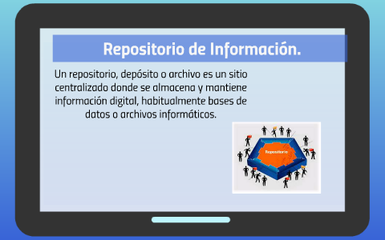
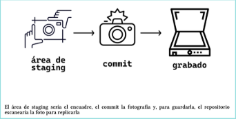
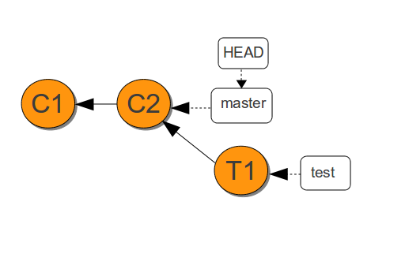

# ProjectGIT
# 📘 INTRODUCCIÓN AL CURSO GIT Y GITHUB

Bienvenido a mi resumen personal del curso de **Git y GitHub**.
---

<p align="center">
  
</p>

# ¿Qué es un control de versiones?

El control de versiones es una herramienta que guarda el historial de todos los cambios realizados en los archivos de un proyecto.

---

<p align="center">
  
</p>

---

Esto permite conocer qué modificaciones se hicieron, quién las realizó y en qué momento, facilitando el seguimiento y la gestión del proyecto a lo largo del tiempo.

# ¿Por qué es tan importante un control de versiones?

🔹 **Optimización**: Solo se guarda lo esencial, lo que mejora el rendimiento del proyecto.  
🔹 **Seguridad**: Cada acción queda registrada, garantizando que nada se pierda.  
🔹 **Flexibilidad**: No es necesario seguir un camino único en el desarrollo; puedes experimentar sin perder el control.  

---

<p align="center">
  
</p>

# Historia de GIT Y GITHUB

---

1990s: Los primeros sistemas de control de versiones fueron creados.  
2005: **Linus Torvalds** creó Git para gestionar el código del kernel de Linux.  
2008: Se fundó **GitHub**, una plataforma para alojar proyectos Git en la web.  
2018: **Microsoft** adquirió **GitHub**.  
2024: **Git** y **GitHub** siguen siendo herramientas esenciales para el desarrollo de software, ampliamente utilizadas en la industria.

---

<p align="center">
  
</p>

# ¿Qué es GIT y GITHUB?

**Git** es un sistema de control de versiones distribuido que ayuda a gestionar y hacer seguimiento de los cambios en los proyectos de software.

**GitHub** es una plataforma basada en la web que aloja proyectos Git, facilitando la colaboración y el control de versiones entre desarrolladores.

---

<p align="center">
  
</p>

# ¿Qué es un repositorio?

Un **repositorio** es un lugar donde se guarda el código fuente y su historial de cambios. Puede estar en tu máquina local o en una plataforma en línea como **GitHub**, permitiendo colaborar y gestionar proyectos de software.

---

<p align="center">
  
</p>

# 🚀 INICIEMOS UN NUEVO PROYECTO GIT

📌 A continuación, te muestro los comandos básicos para comenzar un proyecto Git desde cero.

---

<p align="center">
  
</p>

---

### ✅ 1. Crear la carpeta del proyecto

    ```bash
    mkdir miproyecto
    cd miproyecto
✅ 1. Inicializar Git

     git init
✅ 2. Crear un archivo (ejemplo)

    echo "# Mi proyecto" > README.md
✅ 3. Agregar archivo al staging

    git add README.md
✅ 4. Hacer el primer commit

    git commit -m "Primer commit"
¿Quieres incluir el repositorio en GitHub también? Puedes usar git remote add origin <URL> y luego git push -u origin main.

❓ ¿Este proyecto tiene commits?
Un proyecto tiene commits solo si ya ejecutaste:

    git commit -m "mensaje"
🔹 Si solo hiciste git init y no has hecho ningún commit aún → No tiene commits.
🔹 Si ya hiciste un commit con mensaje → Sí tiene al menos un commit.

✅ Para verificar si tu proyecto tiene commits:
```bash
     git log
     
```


---

# 💻 INSTALACIÓN DE GIT EN WINDOWS

A continuación, te muestro paso a paso cómo instalar Git en tu sistema Windows.

---

Descargar Git:

Ve a la página oficial de Git: https://git-scm.com/download/win.

El archivo de instalación se descargará automáticamente para Windows.

Ejecutar el instalador:

Abre el archivo descargado (.exe) para iniciar el proceso de instalación.

En las opciones de instalación, puedes dejar las configuraciones predeterminadas, pero ten en cuenta lo siguiente:

Selecciona "Use Git from the Windows Command Prompt" para poder usar Git desde la terminal de Windows.

Git Bash será instalado por defecto, lo que te permitirá usar un terminal similar a Unix.

Configurar Git (opcional pero recomendado):

Después de la instalación, abre Git Bash y configura tu nombre y correo electrónico:


      git config --global user.name "Tu Nombre"
      git config --global user.email "tuemail@example.com"
Verificar la instalación:

Abre Git Bash o la terminal de Windows y ejecuta:


    git --version
Esto debería mostrar la versión de Git instalada.

¡Listo! Ahora tienes Git instalado y configurado en tu sistema Windows 10.

---

<p align="center">
  <strong>Instalación de Git y GitHub en Windows</strong><br>
  
</p>

---

✨ States y commits de Git y GitHub
<p align="center">  </p>

¿Sabías que en Git todo pasa por 3 estados antes de subirlo a GitHub?
Es como cocinar:
Working Directory: estás cocinando, todo es un desastre pero vas viendo
🧠 States y commits de Git y GitHub
<p align="center">  </p>
🤔 ¿Y eso de los estados qué onda?
Antes de subir algo a GitHub, Git lo pasa por tres estados básicos, que se sienten más o menos así:

🔧 Working Directory → Estás editando archivos como loco, probando y rompiendo cosas.

📦 Staging Area → Elegiste qué cosas sí quieres guardar. Es como tenerlo listo pero no entregado.

📸 Repository (commit) → Ya está listo y guardado oficialmente en la historia del proyecto. ¡Es como una foto que ya subiste a tu álbum de GitHub


📝 Un commit, ¿qué es?
<p align="center">  </p>
💡 ¿Qué es un commit?
Un commit es como dejar una nota con la foto del momento de tu proyecto.
Dice: “esto fue lo que hice” y queda guardado para siempre.
Cada vez que haces un commit, estás construyendo la historia de tu código, paso a paso.
Y sí, puedes volver atrás si algo explota. 😅


💡 ¿Y cómo se hace un commit?
Hacer un commit es como decir:

"Listo, terminé esta parte. ¡Guárdalo así!"

Es súper fácil, solo tienes que seguir estos pasos:

🧩 Pasos para hacer un commit
bash
Copiar
Editar
# 1. Ver qué archivos cambiaron
    
    git status

# 2. Añadir archivos al área de preparación (staging)
    git add archivo.txt

# O si quieres agregar todos los archivos modificados:
    git add .

# 3. Hacer el commit con un mensaje
    git commit -m 
  "Explicación corta de lo que hiciste"
🚀 Subirlo al repositorio remoto (GitHub)

    git push origin main

´´´


##🚀 ¿Qué es HEAD y para qué sirve?
<p align="center">  </p>
HEAD es como el apuntador de tu proyecto. Te muestra en qué parte de la historia de tu código te encuentras.
Cuando usas HEAD, estás viendo la última versión registrada en tu repositorio. Es esencial para saber en qué punto estás y para cambiar entre ramas o versiones de tu proyecto.

¿Qué hace HEAD?
Se mueve automáticamente cuando haces un commit.

Te ayuda a navegar entre distintas versiones del proyecto.

Es el punto de referencia de tu trabajo actual.

Comandos relacionados con HEAD
Ver HEAD actual:

    ```bash
    git log -1
Mover HEAD a un commit específico (deshacer cambios, revisar versiones anteriores):
      
    ```bash
    git checkout <commit-id>
Volver a la rama principal (main) después de moverse con HEAD:

    git checkout main
Mover HEAD a una rama específica:

      git checkout <nombre-de-la-rama>


# Qué son ramas, merge y cuáles son sus conflictos

<p align="center">
  
</p>

### 🔹 ¿Qué son las ramas en Git?

Las ramas en Git son como diferentes versiones del proyecto que permiten trabajar en distintas funcionalidades sin afectar el código principal. 

### 🔹 ¿Qué es un Merge?

Merge es el proceso de combinar dos ramas diferentes. Se hace para integrar cambios de una rama a otra.

### 🔹 Conflictos de merge

Cuando dos personas modifican la misma parte de un archivo, Git no sabe cuál cambio mantener, y eso genera un conflicto. Se debe resolver manualmente.

### 🚀 Comandos para trabajar con ramas y merge

1. **Crear una rama:**
   ```bash
   git branch <nombre-de-la-rama>

2. **Cambiarse a una rama:**
    ```bash
    git checkout <nombre-de-la-rama>
3. **Fusionar una rama con la rama principal (main):**
    ```bash
    git merge <nombre-de-la-rama>
4. **Resolver conflictos de merge:**
Cuando encuentras un conflicto, Git te lo indicará y debes resolverlo manualmente editando el archivo.
