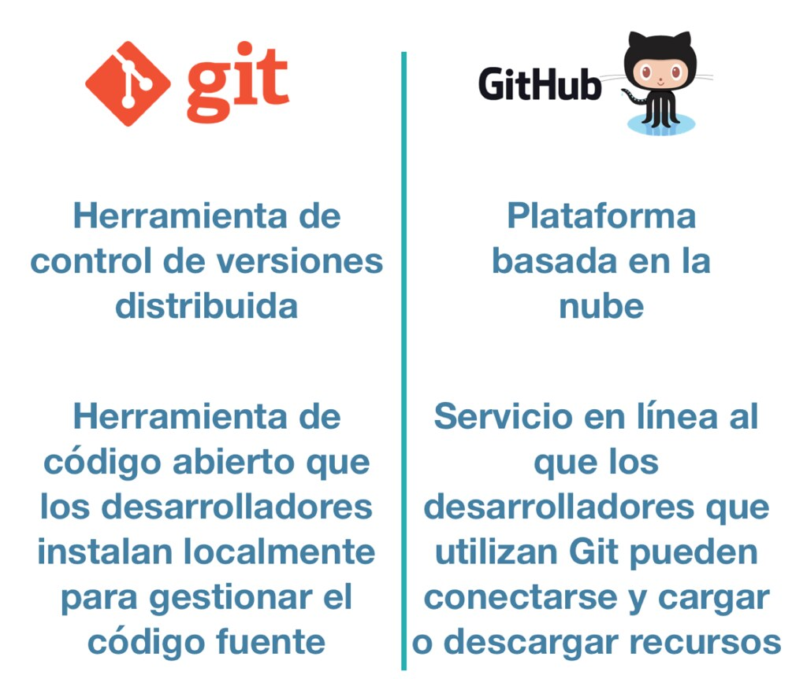

# ProjectGIT
# 📘 INTRODUCCIÓN AL CURSO GIT Y GITHUB

Bienvenido a mi resumen personal del curso de **Git y GitHub**.
---

<p align="center">
  
</p>

# ¿Qué es un control de versiones?

El control de versiones es una herramienta que guarda el historial de todos los cambios realizados en los archivos de un proyecto.

---

<p align="center">
  
</p>

---

Esto permite conocer qué modificaciones se hicieron, quién las realizó y en qué momento, facilitando el seguimiento y la gestión del proyecto a lo largo del tiempo.

# ¿Por qué es tan importante un control de versiones?

🔹 **Optimización**: Solo se guarda lo esencial, lo que mejora el rendimiento del proyecto.  
🔹 **Seguridad**: Cada acción queda registrada, garantizando que nada se pierda.  
🔹 **Flexibilidad**: No es necesario seguir un camino único en el desarrollo; puedes experimentar sin perder el control.  

---

<p align="center">
  
</p>

# Historia de GIT Y GITHUB

---

1990s: Los primeros sistemas de control de versiones fueron creados.  
2005: **Linus Torvalds** creó Git para gestionar el código del kernel de Linux.  
2008: Se fundó **GitHub**, una plataforma para alojar proyectos Git en la web.  
2018: **Microsoft** adquirió **GitHub**.  
2024: **Git** y **GitHub** siguen siendo herramientas esenciales para el desarrollo de software, ampliamente utilizadas en la industria.

---

<p align="center">
  
</p>

# ¿Qué es GIT y GITHUB?

**Git** es un sistema de control de versiones distribuido que ayuda a gestionar y hacer seguimiento de los cambios en los proyectos de software.

**GitHub** es una plataforma basada en la web que aloja proyectos Git, facilitando la colaboración y el control de versiones entre desarrolladores.

---

<p align="center">
  
</p>

# ¿Qué es un repositorio?

Un **repositorio** es un lugar donde se guarda el código fuente y su historial de cambios. Puede estar en tu máquina local o en una plataforma en línea como **GitHub**, permitiendo colaborar y gestionar proyectos de software.

---

<p align="center">
  
</p>

# 🚀 INICIEMOS UN NUEVO PROYECTO GIT

📌 A continuación, te muestro los comandos básicos para comenzar un proyecto Git desde cero.

---

<p align="center">
  
</p>

---

### ✅ 1. Crear la carpeta del proyecto

```bash
mkdir miproyecto
cd miproyecto
✅ 1. Inicializar Git
bash
Copiar
Editar
git init
✅ 2. Crear un archivo (ejemplo)
bash
Copiar
Editar
echo "# Mi proyecto" > README.md
✅ 3. Agregar archivo al staging
bash
Copiar
Editar
git add README.md
✅ 4. Hacer el primer commit
bash
Copiar
Editar
git commit -m "Primer commit"
¿Quieres incluir el repositorio en GitHub también? Puedes usar git remote add origin <URL> y luego git push -u origin main.

❓ ¿Este proyecto tiene commits?
Un proyecto tiene commits solo si ya ejecutaste:

bash
Copiar
Editar
git commit -m "mensaje"
🔹 Si solo hiciste git init y no has hecho ningún commit aún → No tiene commits.
🔹 Si ya hiciste un commit con mensaje → Sí tiene al menos un commit.

✅ Para verificar si tu proyecto tiene commits:

bash
Copiar
Editar
git log
```

---

---

# 💻 INSTALACIÓN DE GIT EN WINDOWS

A continuación, te muestro paso a paso cómo instalar Git en tu sistema Windows.

---

Descargar Git:

Ve a la página oficial de Git: https://git-scm.com/download/win.

El archivo de instalación se descargará automáticamente para Windows.

Ejecutar el instalador:

Abre el archivo descargado (.exe) para iniciar el proceso de instalación.

En las opciones de instalación, puedes dejar las configuraciones predeterminadas, pero ten en cuenta lo siguiente:

Selecciona "Use Git from the Windows Command Prompt" para poder usar Git desde la terminal de Windows.

Git Bash será instalado por defecto, lo que te permitirá usar un terminal similar a Unix.

Configurar Git (opcional pero recomendado):

Después de la instalación, abre Git Bash y configura tu nombre y correo electrónico:

bash
Copiar código
git config --global user.name "Tu Nombre"
git config --global user.email "tuemail@example.com"
Verificar la instalación:

Abre Git Bash o la terminal de Windows y ejecuta:

bash
Copiar código
git --version
Esto debería mostrar la versión de Git instalada.

¡Listo! Ahora tienes Git instalado y configurado en tu sistema Windows 10.

---

<p align="center">
  <strong>Instalación de Git y GitHub en Windows</strong><br>
  
</p>

---

